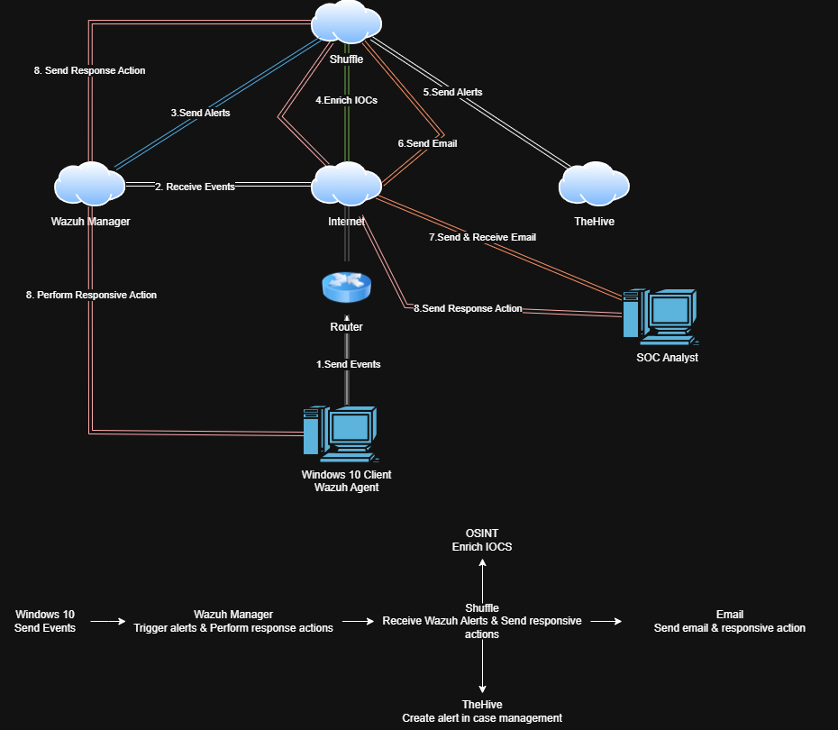
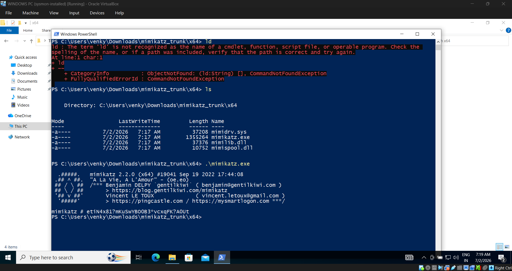
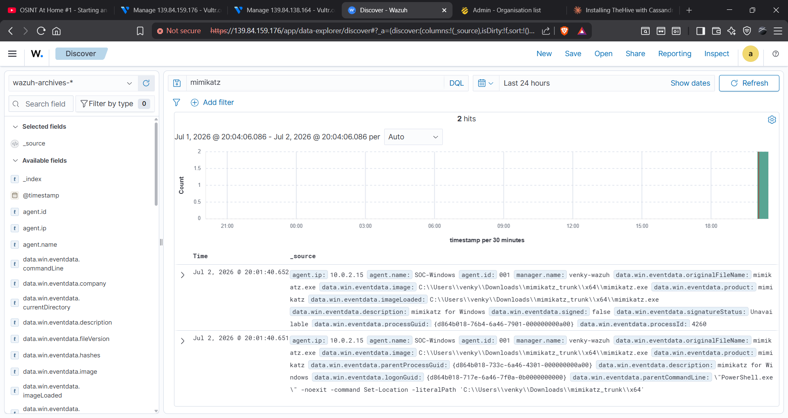
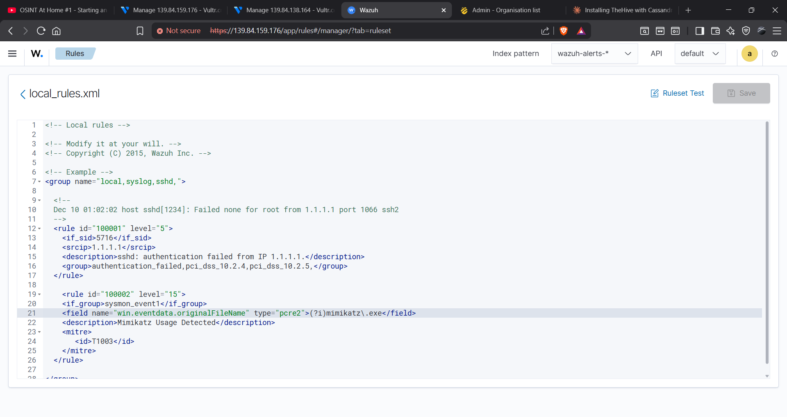
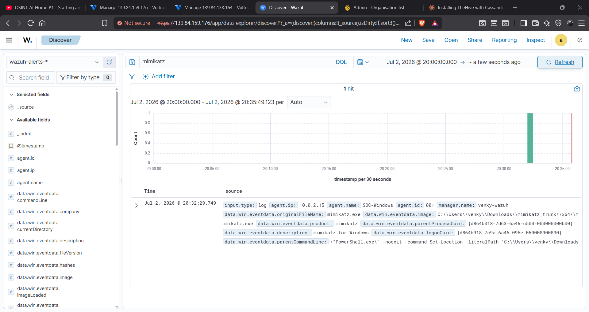
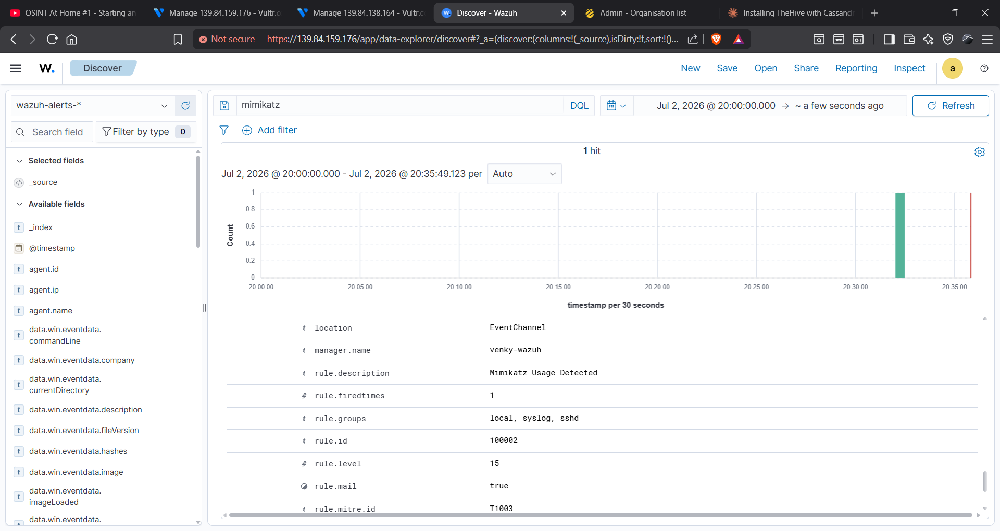
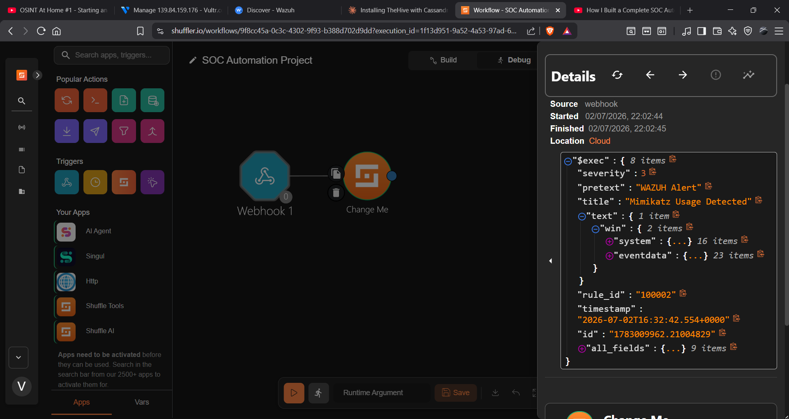
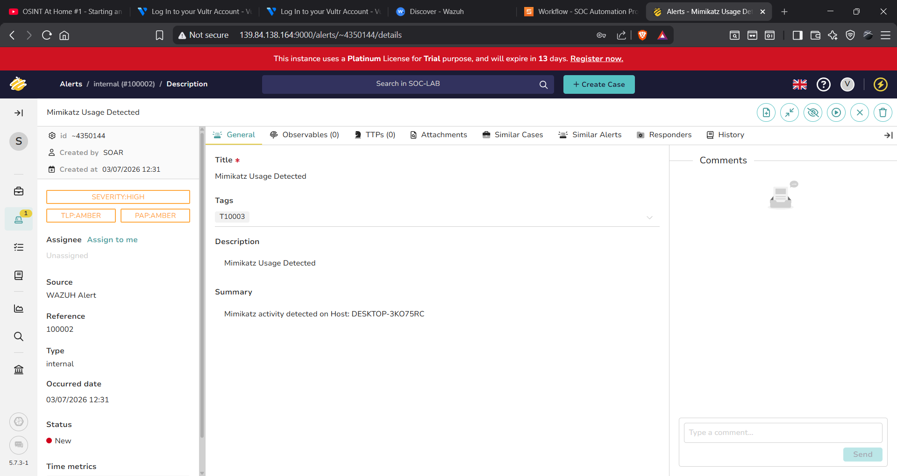

# 🤖 SOC Automation Lab — Wazuh + Shuffle + TheHive

A fully automated SOC pipeline that detects **Mimikatz credential theft**, enriches the alert via **VirusTotal**, auto-creates a case in **TheHive**, and fires an **email alert** to the SOC analyst — all without any manual intervention.

> **Lab 5** of the SOC Home Lab Series

---

## 🎯 What This Proves

Modern SOCs are drowning in alerts. This project shows I can **automate the repetitive Tier-1 work** — taking a raw SIEM alert all the way to an enriched, documented incident case and analyst notification, without a human touching it.

---

## 🏗️ Architecture



### How the pipeline flows:

```
Windows 10 (Mimikatz executed)
        ↓  [1. Send Events]
Wazuh Manager (SIEM)
        ↓  [2. Trigger Alert — Rule ID 100002, Level 15]
Shuffle (SOAR)
        ↓  [3. Receive webhook from Wazuh]
        ↓  [4. Extract hash → Query VirusTotal]
        ↓  [5. Send alert to TheHive → Create case]
        ↓  [6. Send email to SOC Analyst]
SOC Analyst (Gmail alert received)
```

---

## 🔧 Tools & Stack

| Tool | Role | Hosted On |
|------|------|-----------|
| **Wazuh** | SIEM — detects Mimikatz via custom rule | Vultr Cloud |
| **Shuffle** | SOAR — orchestrates the full pipeline | Shuffle.io Cloud |
| **VirusTotal** | IOC enrichment — hash reputation lookup | API |
| **TheHive** | Case management — auto-creates incident | Vultr Cloud |
| **Windows 10** | Endpoint with Wazuh agent + Sysmon | Vultr Cloud |
| **Gmail** | SOC analyst alert notification | Email |

---

## Infrastructure Setup

### TheHive Stack (Vultr Ubuntu 24.04)

**Version compatibility — do not deviate:**
- Java: Amazon Corretto **11 only** (not 8, 17, or 21 — wrong version is #1 cause of TheHive crashes)
- Cassandra: **4.1.x**
- Elasticsearch: **8.x** with `xpack.security.enabled: false`
- TheHive: **5.x**

**Key configuration decisions:**
- Elasticsearch `network.host` stays `127.0.0.1` — security is disabled, binding to public IP would expose the entire database unauthenticated
- Cassandra `listen_address`/`rpc_address` use the real server IP
- Only port **9000** (TheHive UI) is open to the internet; ports 9200 (ES) and 9042 (Cassandra) are firewalled/local-only
- No Cassandra authentication needed for single-node lab — `AllowAllAuthenticator` default


## 📋 Step-by-Step Walkthrough

### Step 1 — Mimikatz Executed on Windows 10

Mimikatz (`mimikatz.exe`) was run via PowerShell on the Windows 10 endpoint. Sysmon captured the process creation event and forwarded it to Wazuh.



---

### Step 2 — Wazuh Custom Detection Rule

A custom rule was written in `local_rules.xml` to detect Mimikatz by filename:

```xml
<rule id="100002" level="15">
  <if_group>sysmon_event1</if_group>
  <field name="win.eventdata.originalFileName" type="pcre2">(?i)mimikatz\.exe</field>
  <description>Mimikatz Usage Detected</description>
  <mitre>
    <id>T1003</id>
  </mitre>
</rule>
```

- **Rule ID:** 100002
- **Level:** 15 (Critical)
- **MITRE ATT&CK:** T1003 — OS Credential Dumping



---

### Step 3 — Wazuh Alert Triggered

Wazuh fired the alert and logged it. Searching `mimikatz` in the Wazuh Discover view shows the full telemetry — agent IP, file path, process GUID, and parent command line.





---

### Step 4 — Shuffle Receives Webhook

Wazuh sent the alert payload to Shuffle via webhook. The raw JSON shows:
- `"title": "Mimikatz Usage Detected"`
- `"severity": 3`
- `rule_id: 100002`
- Full `eventdata` with 23 items including file hash



---

### Step 5 — Shuffle Workflow Executes

The Shuffle workflow automatically:
1. Parsed the alert from the webhook
2. Extracted the file hash
3. Queried **VirusTotal** for hash reputation
4. Sent the enriched alert to **TheHive**
5. Sent an **email** to the SOC analyst



---

### Step 6 — TheHive Case Auto-Created

TheHive automatically received the alert from Shuffle and created an incident case:

- **Title:** Mimikatz Usage Detected
- **Severity:** HIGH
- **TLP:** AMBER | **PAP:** AMBER
- **Source:** WAZUH Alert
- **MITRE Tag:** T10003
- **Summary:** Mimikatz activity detected on Host: DESKTOP-3KO75RC
- **Created by:** SOAR (fully automated)



---

### Step 7 — Email Alert Received

Shuffle automatically sent an email notification to the SOC analyst inbox:

- **Subject:** Sent by email app: Mimikatz Detected
- **From:** Shuffle Email App
- **Body:** Alert message for detecting Mimikatz in Wazuh


---

## ✅ Full Pipeline Validation

| Stage | Tool | Result |
|-------|------|--------|
| Mimikatz executed | Windows 10 + Sysmon | ✅ Process captured |
| Alert fired | Wazuh Rule 100002 | ✅ Level 15 Critical alert |
| Webhook received | Shuffle | ✅ Full JSON payload parsed |
| Hash enrichment | VirusTotal API | ✅ IOC queried automatically |
| Case created | TheHive | ✅ Auto-generated, SEVERITY:HIGH |
| Analyst notified | Gmail | ✅ Email received instantly |

**Total time from execution to email alert: under 60 seconds. Zero manual steps.**

---

## 📁 Repository Structure

```
soc-automation-lab/
├── README.md                  # This file — full walkthrough with screenshots
├── rules/
│   └── local_rules.xml        # Custom Wazuh Mimikatz detection rule
├── docs/
│   └── setup-notes.md         # Infrastructure setup notes
└── screenshots/
    ├── 01-architecture-diagram.png
    ├── 02-mimikatz-execution.png
    ├── 03-wazuh-custom-rule.png
    ├── 04-wazuh-alert-overview.png
    ├── 05-wazuh-alert-telemetry.png
    ├── 06-shuffle-webhook.png
    ├── 07-shuffle-workflow.png
    ├── 08-thehive-case.png
    └── 09-email-alert.png
```

---

## 🎯 Skills Demonstrated

- Wazuh SIEM deployment on cloud (Vultr)
- Custom Wazuh detection rule authoring (XML)
- MITRE ATT&CK mapping (T1003 — Credential Dumping)
- Sysmon endpoint telemetry collection
- Shuffle SOAR workflow design and automation
- VirusTotal API integration for IOC enrichment
- TheHive case management integration
- End-to-end SOC pipeline automation
- Mimikatz attack simulation and detection

---

### Known Issues & Fixes Encountered

| Issue | Fix |
|---|---|
| `cqlsh` broken on Ubuntu 24.04 (`ModuleNotFoundError: six.moves`) | Install standalone cqlsh via pip in a Python venv: `python3 -m venv ~/cqlsh-venv && pip install cqlsh` |
| Elasticsearch fails to start after fresh install (`ElasticsearchSecurityException: xpack.security.transport.ssl`) | Auto-security config stores SSL passwords in the keystore. Fix: wipe keystore, fix directory permissions (`chmod g+w /etc/elasticsearch`), recreate clean keystore, remove `/etc/elasticsearch/certs` |
| StrangeBee apt repo domains fail DNS resolution | Download TheHive directly via wget from `thehive.download.strangebee.com` |
| Cassandra sources file had Markdown bracket syntax instead of plain URL | Delete and recreate the sources file with a plain URL |
| Shuffle integration not triggering (`File not found inside integrations`) | `<name>Shuffle</name>` uses capital S; filename on disk is lowercase. Change to `<name>shuffle</name>` |
| Wazuh integration hook_url had trailing space | Remove trailing space before `</hook_url>` closing tag |

---

## 📌 References

- [Wazuh Documentation](https://documentation.wazuh.com)
- [Shuffle SOAR](https://shuffler.io)
- [TheHive Project](https://thehive-project.org)
- [VirusTotal API](https://developers.virustotal.com)
- [MITRE ATT&CK T1003](https://attack.mitre.org/techniques/T1003/)
- [MyDFIR SOC Automation Series](https://www.youtube.com/@MyDFIR)

---

## 🔗 SOC Home Lab Series

| Lab | Project | Status |
|-----|---------|--------|
| Lab 1 | [NSM Stack — TShark + Zeek + Suricata IDS](https://github.com/Gitlovess/nsm-lab) | ✅ Complete |
| Lab 2 | [pfSense Firewall + Suricata IPS](https://github.com/Gitlovess/pfSense-Suricata-IPS-lab) | ✅ Complete |
| Lab 3 | [Windows 10 Endpoint Hardening](https://github.com/Gitlovess/Windows-10-Endpoint-Hardening) | ✅ Complete |
| Lab 4 | [Linux Server Hardening](https://github.com/Gitlovess/linux-hardening-lab) | ✅ Complete |
| Lab 5 | SOC Automation — Wazuh + Shuffle + TheHive (this repo) | ✅ Complete |
